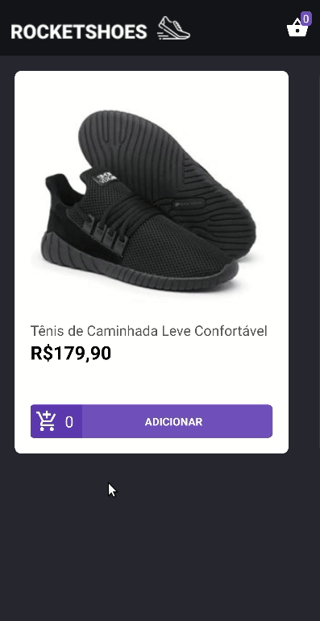

<h1 align="center">
    
</h1>

<h3 align="center">
  Rocketshoes
</h3>

<p align="center"> Desafio 07 do <a href="https://rocketseat.com.br/bootcamp">Bootcamp GoStack</a> 🎓</p>

## :page_facing_up: Índice

- [Sobre](#about)
- [Primeiros passos](#getting_started)
- [Feito com](#built_using)
- [Desafio proposto / Minha solução](#my-solution)
- [Licença](#license)

## 🧐 Sobre <a name = "about"></a>

App de uma loja virtual desenvolvida com React Native e Redux.

## 🏁 Primeiros passos <a name = "getting_started"></a>

Estas instruçōes te darão uma cópia funcional do projeto na sua máquina local para desenvolvimento e testes.
### Pré-requisitos

Instalar as dependências

```sh
yarn install
```

Instalar o json-server

```sh
yarn global add json-server
```

### Rodando a aplicação:

#### Rodando o servidor com json-server:

```sh
json-server server.json -p 3333
```

#### Android:

```sh
react-native run-android
```

#### iOS:

```sh
react-native run-ios
```

#### Iniciando o app:

```sh
react-native start
```

<div align="center" name="my-solution">
  <div>
    <h2>Desafio proposto / Minha Solução</h2>
    
    
  </div>
</div>


## ⛏️ Feito com <a name = "built_using"></a>

- [ReactNative](https://reactnative.dev/)
- [Immer](https://immerjs.github.io/immer/docs/introduction)
- [Redux](https://redux.js.org/)
- [Redux-Saga](https://redux-saga.js.org/)
- [React-Redux](https://react-redux.js.org/)

## :memo: Licença <a name = "license"></a>

Esse projeto está sob a licença MIT. Veja o arquivo [LICENSE](LICENSE) para mais detalhes.
